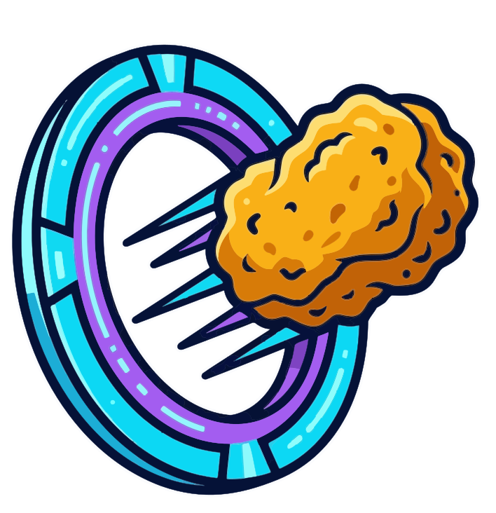

<p align="center">
  
</p>

# Karaagy 🚀

<p align="center">
  <a href="https://github.com/dotvav/karaagy/actions/workflows/ci.yml"></a>
  <a href="https://github.com/dotvav/karaagy/blob/main/LICENSE"></a>
  
  <a href="https://github.com/astral-sh/ruff"></a>
  
  
</p>

**Karaagy** is a lightweight, high-performance API **gateway** that wraps the Google Antigravity CLI (`agy`) into a standard OpenAI-compatible REST and SSE interface. Think of it as that **sweet nugget** bridging the gap between cutting-edge Antigravity intelligence and your favorite AI tools—providing drop-in compatibility for standard OpenAI SDKs (Python, TypeScript), self-hosted web UIs (Open WebUI, LibreChat), and backend automation services (e.g. Mealie, data classification, and extraction pipelines).


---

## 🌟 Key Features

- **OpenAI Standard Endpoints**: Supports `GET /v1/models` and `POST /v1/chat/completions`.
- **Real-Time Streaming**: Full Server-Sent Events (SSE) streaming (`stream: true`) with token deltas.
- **Interactive Web Status Dashboard**: Self-contained, responsive dashboard on `GET /` with live `/usage` quota tracking, concurrency metrics, sanitized environment inspector, and model alias mappings.
- **Dynamic Model Discovery & Alias Routing**: Discovers available models from `agy models` with transparent mapping for common aliases (`gpt-4o`, `gpt-3.5-turbo`, `claude-3-5-sonnet`, `gemini-flash`).
- **Storage Hygiene**: Automatically prunes ephemeral CLI transcripts and conversation state on completion.
- **Resilience**: Built-in exponential backoff retries for transient OAuth/network glitches.

---

## ⚠️ Important Architectural Caveat: Underlying Agentic Layer vs Raw LLM

> [!WARNING]
> **Karaagy wraps an autonomous AI coding assistant (`agy`), NOT a raw inference API.**

Unlike direct model endpoints (e.g. standard OpenAI, Anthropic, or Vertex AI APIs) that return pure next-token probability completions, the underlying Google Antigravity CLI operates as an **agentic system** with its own built-in meta-prompt, coding rules, and tool capabilities.

### 📌 Recommended vs Incompatible Use Cases:

* ✅ **Ideal & Recommended**:
  - **Self-Hosted & Specialized Applications**: Services with OpenAI-compatible backend connectors (e.g. **Mealie** for recipe parsing/ingredient analysis, home lab automation bots, data extraction pipelines) for classification, summarization, structured tagging, and content judging.
  - **Interactive Chat UIs**: Open WebUI, LibreChat, and self-hosted chat portals.
  - **IDE Chat & Explanation Modes**: Continue.dev (sidebar chat, `/edit`), Cursor Chat (`Cmd+L`), and Aider (`--chat-mode ask`) for questions, code explanation, and diff suggestions.
  - **Direct Script Ingestion**: Python/Node.js scripts for summarization, translation, classification, and code drafting.

* ⚠️ **Qualified / Requires Care**:
  - **IDE Prompt-Based Refactoring**: Continue.dev or Aider without client-side tool loops (configure with `capabilities: { tools: false }`).

* ❌ **Incompatible / High Risk of Collisions**:
  - **IDE Autonomous / Agentic Tool Modes (Cursor Composer Agent, Cline Act Mode, Aider Auto-Commit)**: When an IDE tool loop injects tools (`read_file`, `run_command`, `git_status`), `agy` executes them on the **gateway host machine** instead of the user's local workspace, causing **execution hijacking**, namespace collisions, and broken `delta.tool_calls` JSON streams.
  - **Autonomous Agent Harnesses (OpenClaw, SWE-bench runners, AutoGPT)**: Nested agent architectures triggering conflicting tool recursion.
  - **Strict Deterministic Benchmarks**: Evaluations requiring raw base model completion without Antigravity meta-prompt bias.

---

## 🚀 Quickstart

### Prerequisites
- Python >= 3.12
- [`uv`](https://github.com/astral-sh/uv)
- Authenticated Antigravity CLI (`agy`)

### 1. Install & Sync
```bash
uv sync
```

### 2. Run Locally
```bash
uv run uvicorn karaagy.main:app --reload --port 8000
```

---

## 💻 Usage Examples

### Listing Models (`GET /v1/models`)
```bash
curl http://localhost:8000/v1/models
```

### Chat Completion — Non-Streaming (`POST /v1/chat/completions`)
```bash
curl -X POST http://localhost:8000/v1/chat/completions \
  -H "Content-Type: application/json" \
  -d '{
    "model": "gpt-4o",
    "messages": [
      {"role": "system", "content": "You are a concise assistant."},
      {"role": "user", "content": "Explain quantum computing in one sentence."}
    ]
  }'
```

### Chat Completion — Streaming (`stream: true`)
```bash
curl -N -X POST http://localhost:8000/v1/chat/completions \
  -H "Content-Type: application/json" \
  -d '{
    "model": "gemini-3.8-flash-high",
    "messages": [
      {"role": "user", "content": "Count from 1 to 5."}
    ],
    "stream": true
  }'
```

### Using Official OpenAI Python SDK
```python
from openai import OpenAI

client = OpenAI(
    base_url="http://localhost:8000/v1",
    api_key="none",  # Auth not required
)

response = client.chat.completions.create(
    model="gpt-4o",
    messages=[
        {"role": "user", "content": "Hello Antigravity!"},
    ],
    stream=True,
)

for chunk in response:
    content = chunk.choices[0].delta.content
    if content:
        print(content, end="", flush=True)
print()
```

---
 
## 🖥️ Interactive Web Status Dashboard

Access `http://localhost:8000/` in any browser to view the diagnostic dashboard:
- ⚡ **Antigravity Quota Tracking (`/usage`)**: Visual progress bars showing remaining requests and reset times per model tier with on-demand cache refresh.
- 📊 **Gateway Metrics**: Live concurrency, request count, and throughput.
- 🤖 **Model Catalog & Aliases**: Active models and OpenAI compatibility aliases.
- ⚙️ **Sanitized Environment**: Secure inspector with sensitive tokens automatically masked.

---

## 📚 Documentation

- [User Guide](docs/user_guide.md) — Comprehensive client integration (Python, TypeScript, Open WebUI, LibreChat, Continue.dev, Cursor, Vision/Multimodal), model aliases, and configuration reference.
- [Installation & Deployment Guide](docs/installation_guide.md) — Host user isolation (UID 8888), OAuth persistence, and Docker production deployment.
- [Developer Guide](docs/developer_guide.md) — Architecture, testing, and contribution guidelines.

---

## 🧪 Verification & Static Checks

```bash
# Code Formatting & Linting
uv run ruff check
uv run ruff format --check

# Strict Type Checking
uv run mypy .

# Test Suite
uv run pytest
```

---

## 🐳 Docker Deployment

```bash
docker compose up -d
```

