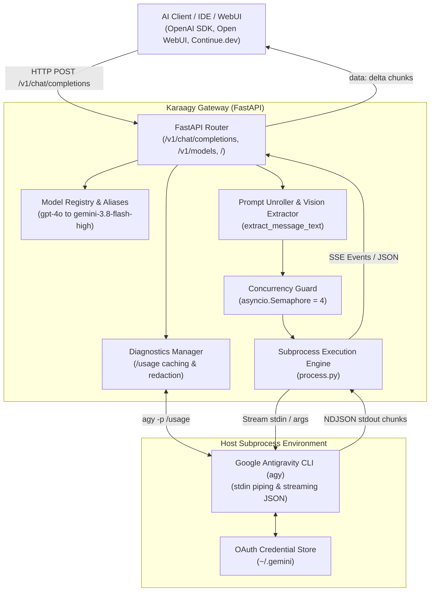

# Karaagy Developer & Architecture Guide 🛠️

This guide covers the technical architecture, internal data flow, and development guidelines for engineers contributing to **Karaagy**.

---

## 📐 System Architecture

Karaagy acts as an asynchronous translation bridge between the standard **OpenAI REST/SSE protocol** and the **Google Antigravity CLI (`agy`)**.



---

## 🔄 Core Request Lifecycle & Processing Pipeline

### 1. Ingestion & Prompt Unrolling ([`prompt.py`](file:///home/roukine/workspaces/karaagy/src/karaagy/core/prompt.py))
- Accepts standard OpenAI message arrays (`system`, `user`, `assistant`, `tool`).
- Unrolls multimodal structured parts (`type: "text"` and `type: "image_url"`).
- Decodes base64 data URIs into temporary disk files (`/tmp/karaagy_images/`) to prevent POSIX `ARG_MAX` / stdin buffer saturation.

### 2. Concurrency Control ([`process.py`](file:///home/roukine/workspaces/karaagy/src/karaagy/core/process.py))
- Uses `asyncio.Semaphore(settings.max_concurrent_sessions)` (default: `4`) to prevent token contention, gRPC subscriber lag, and high memory exhaustion on the host runner.
- Excess incoming requests queue in memory at the FastAPI level and execute smoothly as slots free up.

### 3. Asynchronous Subprocess Execution ([`process.py`](file:///home/roukine/workspaces/karaagy/src/karaagy/core/process.py))
- Spawns `agy` with `--output-format stream-json` or `--output-format json`.
- Streams prompt text directly via standard input `stdin=asyncio.subprocess.PIPE` rather than command-line arguments to bypass POSIX argument length limits.
- Parses stdout line-by-line using an asynchronous generator:
  - Yields token delta SSE chunks (`data: {"choices": [{"delta": {"content": "..."}}]}`).
  - Captures returned `conversation_id` from the terminal payload.

### 4. Ephemeral Storage Pruning ([`process.py`](file:///home/roukine/workspaces/karaagy/src/karaagy/core/process.py#L28-L46))
- Upon request completion or client disconnection, the gateway immediately deletes:
  - The conversation brain directory: `~/.gemini/antigravity-cli/brain/<conversation_id>/`
  - The conversation JSON record: `~/.gemini/antigravity-cli/conversations/<conversation_id>.json`
  - Temporary decoded image files in `/tmp/karaagy_images/`
- Prevents disk exhaustion on long-running servers.

### 5. Diagnostics & `/usage` Caching ([`diagnostics.py`](file:///home/roukine/workspaces/karaagy/src/karaagy/core/diagnostics.py))
- Queries `agy -p "/usage"` asynchronously with an in-memory TTL cache (default: 10 minutes).
- Cache is automatically warmed during FastAPI startup (`lifespan`).
- All environment variables matching `TOKEN`, `KEY`, `SECRET`, `AUTH`, and `PASS` are redacted before exposure in diagnostic APIs or the HTML dashboard.

---

## 📁 Codebase Layout

```
karaagy/
├── .github/                      # GitHub Actions CI/CD workflows & issue templates
├── assets/                       # Public project SVG assets
├── docs/                         # Developer, user, and installation documentation
├── src/
│   └── karaagy/
│       ├── api/                  # FastAPI routes & templates
│       │   ├── router.py         # Main API router mounting
│       │   ├── routes_chat.py    # POST /v1/chat/completions (sync & SSE stream)
│       │   ├── routes_health.py  # GET /healthz and GET /v1/health
│       │   ├── routes_models.py  # GET /v1/models and GET /v1/models/{model}
│       │   ├── routes_status.py  # GET / status page & /favicon endpoints
│       │   └── templates.py      # Self-contained status dashboard HTML renderer
│       ├── core/                 # Core engine & orchestration
│       │   ├── diagnostics.py    # Runtime metrics, /usage caching & env sanitization
│       │   ├── process.py        # Subprocess runner, NDJSON stream parser & pruning
│       │   ├── prompt.py         # OpenAI message unrolling & image decoding
│       │   ├── registry.py       # Dynamic agy model discovery & alias mapping
│       │   └── sanitization.py   # Secret redaction & allowlist logic
│       ├── config.py             # Pydantic Settings & environment variable schema
│       └── main.py               # FastAPI entrypoint, lifespan & CLI launcher
├── tests/                        # Comprehensive unit & integration test suite
├── Dockerfile                    # Multi-stage container build with UID 8888 isolation
└── pyproject.toml                # Project metadata, dependencies & tool configuration
```

---

## 🧪 Development & Quality Assurance Workflow

All contributions must strictly satisfy our static verification pipeline before merge:

```bash
# 1. Formatting & Code Style (Ruff)
uv run ruff check
uv run ruff format --check

# 2. Strict Static Typing (Mypy)
uv run mypy .

# 3. Unit Test Suite (Pytest)
uv run pytest
```

---

## 🔬 Testing Guidelines

* Write unit tests under `tests/` matching the pattern `test_*.py`.
* Mock external subprocess executions (`asyncio.create_subprocess_exec`) using `unittest.mock.AsyncMock` or pytest fixtures.
* Ensure tests run isolated in memory without requiring real Antigravity credentials or network access.
