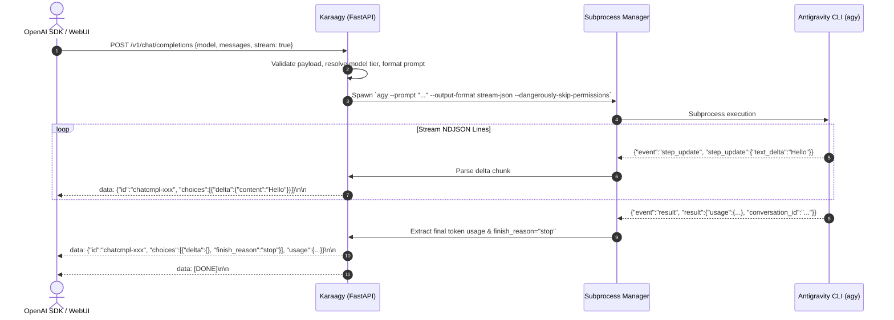
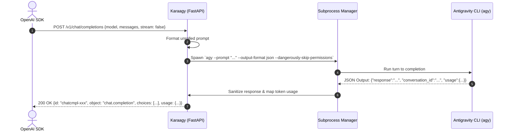

# RFC: Karaagy — OpenAI-Compatible API Wrapper for Antigravity CLI

## 1. Executive Summary & Objectives

**Karaagy** is a lightweight, asynchronous FastAPI service that exposes a standard OpenAI-compatible REST and Server-Sent Events (SSE) API (`GET /v1/models` and `POST /v1/chat/completions`) backed by the Google Antigravity CLI (`agy`).

### Core Objectives
1. **Drop-in OpenAI Compatibility**: Allow standard OpenAI SDKs (Python, TypeScript, LangChain, LlamaIndex, LiteLLM, Continue, Open WebUI) to interact seamlessly with Antigravity models without client code modifications.
2. **First-Class Streaming & Non-Streaming**: Support real-time token streaming (`stream: true`) using `agy --output-format stream-json` and Server-Sent Events (`text/event-stream`), alongside synchronous batched completions (`stream: false`).
3. **Dynamic Model Discovery & Tier Routing**: Dynamically discover available backend models via `agy models`, mapping common OpenAI aliases (e.g., `gpt-4o`, `gpt-3.5-turbo`, `gemini-flash`) to optimal Antigravity model configurations.
4. **Resilience & Sanitization**: Inherit and refine proven retry patterns from the Golemini project to handle transient CLI/OAuth glitches, while sanitizing internal agent metadata before returning responses.
5. **Session & Context Management**: Support both stateless multi-message prompt unrolling and stateful multi-turn conversation caching via conversation IDs (`X-Conversation-Id` or request body parameters).

---

## 2. Mandatory Architectural Trade-off Analysis

### 2.1 Backend Process Execution & Streaming Engine

| Criterion | Option A: Custom Subprocess Wrapper with Async NDJSON Streaming (Selected) | Option B: Heavy Gateway Proxy (LiteLLM / Ollama Fork) | Option C: Custom C-Bindings / IPC Daemon |
| :--- | :--- | :--- | :--- |
| **Description** | Pure Python async subprocess manager using `asyncio.create_subprocess_exec` reading lines from `agy --output-format stream-json`. | Embedding LiteLLM custom provider or proxying through external LLM gateway frameworks. | Building a long-running C/Go sidecar daemon communicating over Unix sockets / gRPC. |
| **Pros** | Minimal memory footprint; zero external C dependencies; direct 1:1 control over CLI flags and token streams; transparent debugging. | Rich ecosystem of middleware (caching, budget tracking, load balancing). | Lowest theoretical invocation latency per token. |
| **Cons** | Requires in-house parsing of CLI NDJSON events and token delta extraction. | Heavyweight dependency tree; complex configuration; higher container startup time; anti-YAGNI. | Extreme maintenance complexity; fragile against upstream AGY CLI binary updates. |
| **Maintenance Complexity** | **Low** (~200 lines of robust async stream parsing). | **High** (Upstream dependency drift, complex plugin hooks). | **Very High** (IPC lifecycle, socket management, binary drift). |
| **Verdict** | **Selected (Option A)**: Provides full control over CLI flags (`--dangerously-skip-permissions`, `--effort`, `--model`), ultra-fast container startup, and zero heavy dependencies. |

---

### 2.2 Conversation State Strategy & Storage Retention

| Criterion | Option A: Client-Managed Multi-Turn (Unrolled Messages) with Automated Storage Pruning (Selected) | Option B: Hybrid (Client Messages + AGY Session ID Cache) | Option C: Centralized Stateful Session Database (PostgreSQL / Redis) |
| :--- | :--- | :--- | :--- |
| **Description** | Every completion request reconstructs the full context into an unrolled system/user prompt. An internal retention cleaner prunes ephemeral `~/.gemini/antigravity-cli/brain/` sessions created by Karaagy. | Client can pass an optional `conversation_id`, or Karaagy falls back to unrolling message history. | Server stores all conversation histories in a persistent database and maps arbitrary session IDs. |
| **Pros** | Fully stateless; immune to container restarts; zero client friction; storage stays lean via background TTL retention pruning. | Fast native AGY session resumption when client supports it. | Complete audit trail; server-side pagination of past conversations. |
| **Cons** | Higher token consumption per turn on long contexts. | Accumulates long-lived state on disk if client does not explicitly delete sessions. | Heavy operational overhead; external database requirement. |
| **Maintenance Complexity** | **Low** | **Low-Medium** | **High** |
| **Verdict** | **Selected (Option A with Storage Pruning)**: Stateless message formatting for maximum OpenAI SDK compatibility, coupled with an automatic background cleanup job to prune ephemeral CLI conversation artifacts and prevent disk clutter. |

---

### 2.3 Authentication Strategy

- **Open Local API**: No authentication is enforced by default (`Authorization` header is ignored or optional), providing frictionless drop-in compatibility for local AI tools (e.g., Open WebUI, Continue.dev, LiteLLM, Ollama-compatible clients).

---

## 3. System Architecture & Component Design

```mermaid
flowchart TD
    subgraph Client Layer
        SDK[OpenAI Client / LangChain / Open WebUI]
    end

    subgraph Karaagy Service (FastAPI)
        AUTH[Auth Middleware / Bearer Token Check]
        ROUTER[FastAPI APIRouter]
        
        subgraph Endpoints
            MODELS_EP["GET /v1/models"]
            CHAT_EP["POST /v1/chat/completions"]
            HEALTH_EP["GET /healthz & /v1/health"]
        end

        subgraph Core Engine
            REGISTRY[Model Registry & Tier Router]
            PROMPT_BLDR[Prompt & Message Formatter]
            PROC_MGR[Async Subprocess Manager]
            SANITIZER[Response Sanitizer & Error Classifier]
            STREAMER[SSE Token Streamer]
        end
    end

    subgraph Subsystem
        AGY_CLI[Antigravity CLI: agy]
    end

    SDK <-->|HTTP / Bearer Token| AUTH
    AUTH --> ROUTER
    ROUTER --> MODELS_EP
    ROUTER --> CHAT_EP
    ROUTER --> HEALTH_EP

    MODELS_EP <-->|Query & TTL Cache| REGISTRY
    REGISTRY <-->|`agy models`| AGY_CLI

    CHAT_EP --> PROMPT_BLDR
    PROMPT_BLDR --> PROC_MGR
    PROC_MGR -->|`agy --prompt ... --output-format stream-json`| AGY_CLI
    
    AGY_CLI -->|NDJSON stdout| PROC_MGR
    PROC_MGR --> SANITIZER
    SANITIZER --> STREAMER
    STREAMER -->|SSE Chunks / JSON Response| SDK
```

---

## 4. Detailed Sequence Workflows

### 4.1 Streaming Completion Flow (`stream: true`)



### 4.2 Non-Streaming Completion Flow (`stream: false`)



---

## 5. API Specification & Compatibility Contract

### 5.1 `GET /v1/models`
- **Response Format**: Standard OpenAI `ModelList`
```json
{
  "object": "list",
  "data": [
    {
      "id": "gemini-3.8-flash-high",
      "object": "model",
      "created": 1700000000,
      "owned_by": "antigravity"
    },
    {
      "id": "claude-sonnet-4-6",
      "object": "model",
      "created": 1700000000,
      "owned_by": "antigravity"
    },
    {
      "id": "gpt-4o",
      "object": "model",
      "created": 1700000000,
      "owned_by": "antigravity"
    }
  ]
}
```

### 5.2 `POST /v1/chat/completions`
- **Request Schema**:
  - `model` (str, required): Model ID or alias.
  - `messages` (list[ChatCompletionMessage], required): System, user, assistant messages.
  - `stream` (bool, optional, default `false`): Enable SSE streaming.
  - `temperature`, `top_p`, `max_tokens` (optional): Accepted for compatibility.
  - `conversation_id` (str, optional): Custom extension for AGY session resumption.
  - `effort` (str, optional: `low` | `medium` | `high`): Antigravity reasoning effort control.

- **Response (Non-Streaming)**: Standard `ChatCompletion` object with usage stats.
- **Response (Streaming)**: SSE stream with `chat.completion.chunk` events ending with `data: [DONE]`.

### 5.3 Error Handling
Standard OpenAI error format:
```json
{
  "error": {
    "message": "AGY execution failed: Rate limit exceeded",
    "type": "invalid_request_error",
    "param": null,
    "code": "rate_limit_exceeded"
  }
}
```

---

## 6. Directory & Codebase Structure

```
karaagy/
├── docs/
│   ├── plans/
│   │   └── rfc_system_design.md
│   ├── developer_guide.md
│   └── user_guide.md
├── src/
│   └── karaagy/
│       ├── __init__.py
│       ├── main.py               # FastAPI application lifecycle & entry point
│       ├── config.py             # Pydantic Settings (Host, Port, API Key, AGY Bin)
│       ├── models/
│       │   ├── __init__.py
│       │   ├── openai.py         # Pydantic models for OpenAI request/response schemas
│       │   └── agy.py            # Pydantic models for AGY CLI JSON & NDJSON events
│       ├── api/
│       │   ├── __init__.py
│       │   ├── router.py         # Main /v1 router
│       │   ├── routes_models.py  # GET /v1/models endpoint
│       │   ├── routes_chat.py    # POST /v1/chat/completions endpoint
│       │   └── routes_health.py  # /healthz and /v1/health endpoints
│       ├── core/
│       │   ├── __init__.py
│       │   ├── process.py        # Async subprocess execution & stream reader
│       │   ├── registry.py       # Model discovery, tier aliases, and TTL caching
│       │   ├── prompt.py         # OpenAI messages unrolling & prompt synthesis
│       │   └── sanitization.py   # Output cleanup & retryable error classifier
│       └── dependencies.py       # Auth verification & dependency injection
├── tests/
│   ├── conftest.py
│   ├── test_models_endpoint.py
│   ├── test_chat_completions_sync.py
│   ├── test_chat_completions_stream.py
│   ├── test_prompt_builder.py
│   └── test_sanitization.py
├── Dockerfile                    # Containerization with non-root appuser
├── docker-compose.yml            # Portainer / Docker Compose definition
├── pyproject.toml
└── README.md
```

---

## 7. Phased Implementation Roadmap

- [ ] **Phase 0: Design & RFC Approval** (Current)
  - Finalize API schemas, architectural choices, and clarify specific client use cases.
- [ ] **Phase 1: Project Setup & Core Data Models**
  - Rename template package to `karaagy`.
  - Define OpenAI Pydantic schemas (`ChatCompletionRequest`, `ChatCompletionResponse`, `ModelList`, `ModelCard`, `ErrorResponse`).
  - Define AGY JSON/NDJSON models for parse validation.
- [ ] **Phase 2: Subprocess Engine & Model Registry**
  - Implement dynamic model discovery via `agy models` with TTL cache and fallback aliases.
  - Build asynchronous subprocess manager supporting both `json` and `stream-json` execution.
  - Implement retry loops for transient errors (`broken pipe`, `EOF`, `429`, `overloaded`).
- [ ] **Phase 3: OpenAI Endpoints & SSE Streaming**
  - Implement `GET /v1/models`.
  - Implement `POST /v1/chat/completions` (synchronous mode).
  - Implement `POST /v1/chat/completions` (SSE streaming mode via `StreamingResponse`).
  - Implement bearer token authentication middleware.
- [ ] **Phase 4: Quality & Verification**
  - Unit tests with mock subprocess runners covering all endpoints, stream chunk parsing, and error responses.
  - Static type checking (`mypy .`) and linting (`ruff check`).
- [ ] **Phase 5: Containerization & Documentation**
  - Update `Dockerfile` and `docker-compose.yml` configured for non-root user `karaagy` (UID 8888).
  - Document setup, endpoint usage with standard OpenAI Python / cURL examples in `README.md`.
